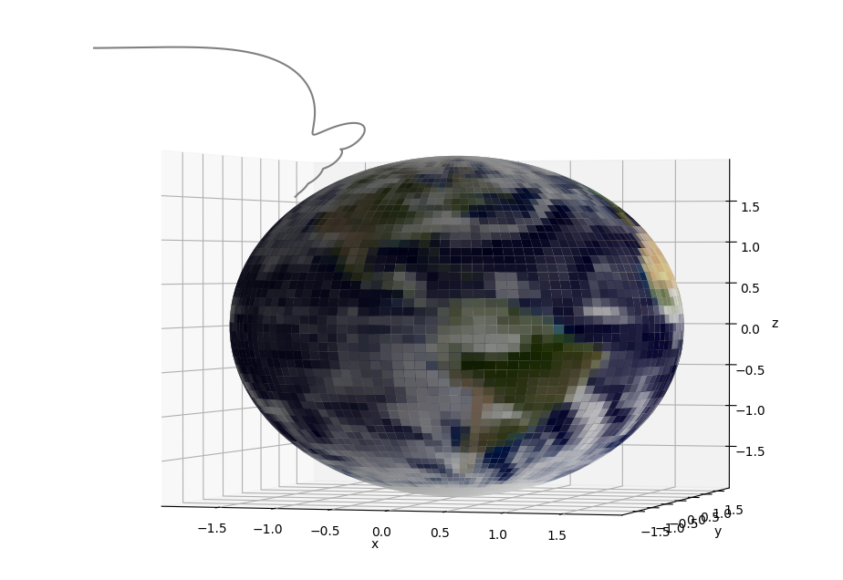
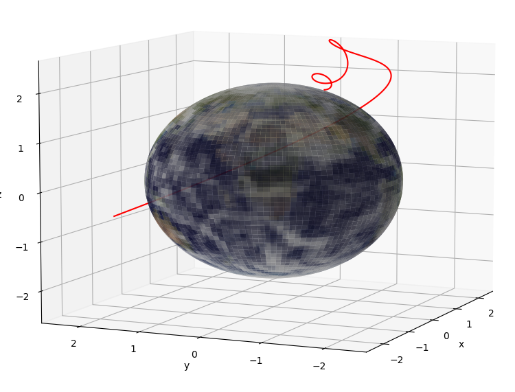
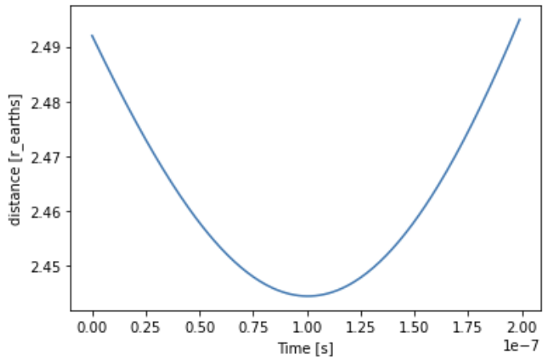
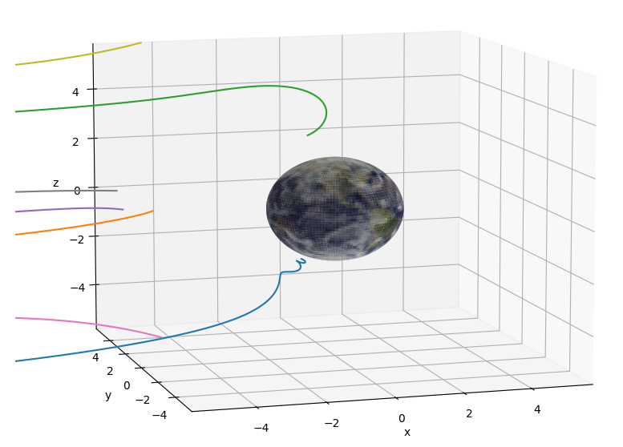
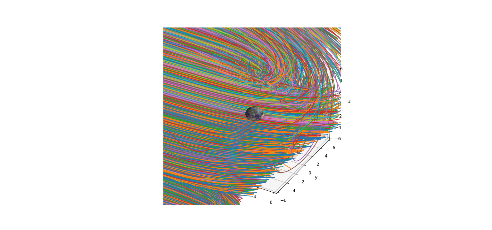

# Weekly progress journal

## Week 1
1. General
    - Background information gathering
    - Basic simulation implementation
        - Magnetic field
        - Earth (with tilt)
        - Particle system
    - Runge Kutta 4th order implementation
        - For errors smaller than 5th order
    - Numba implementation
        - Significant improvement in computation speed
    - 3D plots
        - Earth model
        - Particle trajectories
 
 
2. Review (w.r.t) original plan
    - Nothing
 
 
3. Things that need improvement
    - Electron implementation
        - Electron behaviour is not as expected, spiral forming not always present.
    - Jim - Install proper IDE, current one is not working correctly for 3D plotting

4. Summary
    - We chose to neglect relativity. The initial speeds are not within 1/10 the velocity of the speed of light, thus relativity can be neglected (might change in the future).
    - Beta- particles move as expected, starting with a low- to high solar velocity (250km/s-2000km/s), which is a non-relativistic speed, spiral forming is present. These are shown in the figure below.
    
    
    
    - The figure below shows a better 3D behaviour, with a different starting location.
    
    
    
    - For Beta- particles, the behaviour is not as expected, probably due to a bug in the force calculations. Spiral forming is not present and thus requires a fix.
    - Some particles, with a high velocity field will get deflected by the earths magnetic field, just as expected, the velocities plot over time is shown in the figure below, please note that for the second image, the time is not properly shifted.
    
    
    
    
    
    - This shielding of the earth is to be expected. A goal is to find specific initial location(s) ranges and velocity ranges where this does not happen. The code is written in such a way, that when the velocity reaches a very low value, the simulation is aborted to increase computing speed. This is because stationary particles are not of interest.
    - A beautifull image is shown below with various trajectories.
    
        
    
    - For next week, we expect to have an array of parallel incoming particles, and follow the trajectory of each individual particle with varying incoming speeds. 
 
 
5. Questions
    - None
 
 
6. Next weeks milestones

    - [ ] Implement time dependent velocity plots
    - [ ] Implement time dependent distance plots
    - [ ] Extrapolate measured quantities at a distance of (r_earth+variable) 
    - [ ] Initial ReadMe file
    - [ ] Fix electron movement
    - [ ] Data gathering for incoming particles
 
 

## Week 2
1. Answer on feedback on last week's progress update:
    - I'm confused about some of your remarks: once you say "beta particles behave as expected" and then "beta particles have a bug". What is true?
        - Both are true; we can see that the beta particles (electrons) follow a spiralling trajectory around magnetic field lines
        - However, the 'bug' is that the particles did not seem to reach the Earth (unstable trajectories) due to the low resolution in time-steps (dt).
        - We fixed this 'bug' by increasing the resolution of time-steps (dt).
        - It was not entirely a 'bug' however, since a lower resolution in time-steps would lead to more unstable trajectories; therefore, these particles would (possibly) never be able to reach close to the Earth.
    - In general, I would really like to see a more explicit validation. How do you know your trajectories are ok? Can you compare to a paper?
        - https://folk.ntnu.no/anderhja/aurora/aurora.pdf
            - This paper shows similar spiraling trajectories (although our particle' trajectories are not shown in the Van Allen radiation belt but only in the polar cusp(s)).
        - https://ase.tufts.edu/cosmos/view_chapter.asp?id=29&page=1
            - "An energetic charged particle moves around the magnetic fields in a spiral path that becomes more tightly coiled in the stronger magnetic fields close to a magnetic pole. The intense polar fields act like a magnetic mirror, turning the particle around so it moves back toward the other pole."
            - Our particles can get deflected as well (into the Van Allen radiation belt) for longer simulation times
2. General progress update
    - Information gathering
        - No positrons (Sun does not emit those as much as electrons)
        - Only electrons (no protons, no alpha particles => these are not interesting for Aurora Borealis)
        - Gathered information for coming week
            - Electron absorption in atmosphere (640 km ~ 60 km altitude)
            - 640 km = approx. 0.1 R_Earth, 60 km = approx. 0.01 R_earth
            - Red light emission at highest altitudes, green light around 160 km, blue and purple at lowest altitudes
            - Green light has highest probability
            - Altitude for where electron is absorbed is dependent on energy of electron (higher energy can pass further to reach lower altitudes)
    - Extended simulation implementation
        - Changed Earth's axial tilt (so North Pole collects more particles)
        - Simulation is no longer cut off (unlike before) when a condition is met (not moving towards the Earth any more)
        - Multi-threaded simulation (from 1 to 16 times faster than single-threaded)
        - Numpified and Numbafied simulation
        - Implemented custom grid to improve results
    - Simplified simulation implementation
        - The simulation will focus on the North Pole only due to the low amount of particles we are working with
        - We are neglecting particles returning to the North Pole through the Van Allen radiation belt (simulation time would be too long)
        - We will only work with directly incoming particles that enter through the polar cusp on the North pole side.
        - We create our custom grid so we can collect as much particles as possible in the atmosphere of the Earth (realistically the majority of the particles are deflected by the Earth's magnetic field as expected)
    - Datasets
        - Generate datasets with end trajectories (ending closest to Earth)
        - End trajectories are cut off to save space
        - Datasets are compressed to save space
        - Initial datasets have been created (10000 (100x100) and 32400 (180x180) particles)
    - 3D plots
        - Only relevant trajectories are plotted now (Particles ending closer than 1.1 * R_Earth)
        - Earth axial tilt has been changed into opposite direction so the North pole attracts more particles than the South pole.
    - Code
        - Cleaned up code
        - Optimized code
        - Added comments
 
 
3. Review (w.r.t) original plan
    - We could have made more progress on finalizing the project first instead of optimizing the project...
    - [x] Implement time dependent velocity plots
    - [x] Implement time dependent distance plots
    - [ ] Extrapolate measured quantities at a distance of (r_earth+variable)
        - Instead we improved simulation resolution in time which gave expected results
    - [ ] Initial ReadMe file
        - Moved to coming week
    - [x] Fix electron movement
    - [x] Data gathering for incoming particles
 
 
4. Things that need improvement
    - Electron absorption should be implemented
    - Reduce dataset file-size (maybe discard all non-interesting particle trajectories)
    - Functions need descriptions (and comments)
    - Minor PEP8 errors are present
    - ReadMe file
    - Optional: We could implement simple relativistic effects
    - Optional: Adaptive Runge-Kutta implementation (too much work for this little time probably)
        - Higher dt steps further away from Earth, lower dt steps closer to Earth

5. Summary
    - Beta- particles move as expected, starting with a low- to high solar velocity (300km/s-750km/s near-Earth):
    
    
    
    - This shielding of the Earth is to be expected, which means most simulated particles will be rendered useless:
     
    
    
    - Before the particles would go to either the North or South pole, but since we wanted to focus on the North pole only, we adjusted our grid and parameters such to get the following:
    
        
 
 
6. Questions
    - None
 
 
7. Next weeks milestones
    - [ ] Create animated trajectories
    - [ ] Implement electron absorption
    - [ ] Create plots for latitude vs. absorption
    - [ ] Initial ReadMe file
    - [ ] Finalization of project
    - [ ] Start preparing presentation
    - [ ] Other points mentioned in point 4 (points of improvement)
 
 

