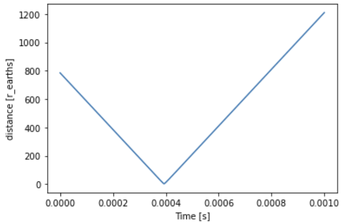

# Weekly progress journal

## Week 1
1. General
    - Background information gathering
    - Basic simulation implementation
        - Magnetic field
        - Earth (with tilt)
        - Particle system
    - Runge Kutta 4th order implementation
        - For errors smaller than 5th order
    - Numba implementation
        - Significant improvement in computation speed
    - 3D plots
        - Earth model
        - Particle trajectories
 
 
2. Review (w.r.t) original plan
    - Nothing
 
 
3. Things that need improvement
    - Electron implementation
        - Electron behaviour is not as expected, spiral forming not always present.
    - Jim - Install proper IDE, current one is not working correctly for 3D plotting

4. Summary
    - We chose to neglect relativity. The initial speeds are not within 1/10 the velocity of the speed of light, thus relativity can be neglected (might change in the future).
    - Beta- particles move as expected, starting with a low- to high solar velocity (250km/s-2000km/s), which is a non-relativistic speed, spiral forming is present. These are shown in the figure below.
    
    
    
    - The figure below shows a better 3D behaviour, with a different starting location.
    
    
    
    - For Beta- particles, the behaviour is not as expected, probably due to a bug in the force calculations. Spiral forming is not present and thus requires a fix.
    - Some particles, with a high velocity field will get deflected by the earths magnetic field, just as expected, the velocities plot over time is shown in the figure below, please note that for the second image, the time is not properly shifted.
    
    
    
    
    
    - This shielding of the earth is to be expected. A goal is to find specific initial location(s) ranges and velocity ranges where this does not happen. The code is written in such a way, that when the velocity reaches a very low value, the simulation is aborted to increase computing speed. This is because stationary particles are not of interest.
    - A beautifull image is shown below with various trajectories.
    
        
    
    - For next week, we expect to have an array of parallel incoming particles, and follow the trajectory of each individual particle with varying incoming speeds. 
 
 
5. Questions
    - None
 
 
6. Next weeks milestones

    - [ ] Implement time dependent velocity plots
    - [ ] Implement time dependent distance plots
    - [ ] Extrapolate measured quantities at a distance of (r_earth+variable) 
    - [ ] Initial ReadMe file
    - [ ] Fix electron movement
    - [ ] Data gathering for incoming particles
 
 
